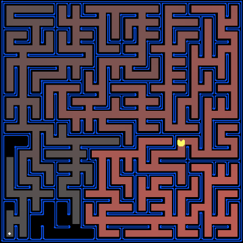

# Pacman-Corners

This app solves the problem of crossing all the corners in the context of the Pacman Framework, using A* as its search algorithm.

To solve this problem, I implemented two heuristics:

1. The number of unvisited corners
2. Manhattan distance to the next unvisited corner

The heuristic based on the number of unvisited corners is the simplest heuristic and
works best on maps as small as possible, and the heuristic based on the manhattan distance to the next unvisited corner is a much more optimal solution in all cases.
